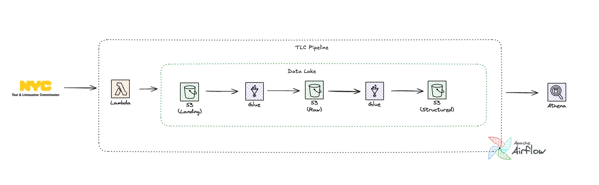

# NYC Taxi Data Lake — Production-Grade Pipeline on AWS

[](https://aws.amazon.com/)
[](https://www.python.org/)
[](https://airflow.apache.org/)
[](https://www.terraform.io/)

> A production-grade data lake on AWS processing **40M+ NYC taxi records** with automated ETL, a data quality framework, and analytics-ready storage. Built to demonstrate patterns used in real-world data platforms: reusable ingestion, layered storage, quality contracts, and partitioned analytics.

---

## Table of Contents

- [Project Overview](#project-overview)
- [Architecture](#architecture)
- [Key Design Decisions](#key-design-decisions)
- [Key Features](#key-features)
- [Repository Structure](#repository-structure)
- [Technology Stack](#technology-stack)
- [Quick Start](#quick-start)
- [Metrics & Results](#metrics--results)
- [Data Quality & Monitoring](#data-quality--monitoring)
- [Testing](#testing)
- [Future Enhancements](#future-enhancements)
- [Author](#author)

---

## Project Overview

This project implements a **scalable, fault-tolerant data lake** on AWS following modern data platform patterns. It is designed to show how a single reusable ingestion engine, a layered storage model, and embedded data quality checks come together to support analytics and ML use cases at scale.

The architecture generalizes beyond taxi data — the same patterns apply to any domain involving **high-volume event data with time-series characteristics**, including e-commerce transactions, marketplace activity, financial events, or IoT telemetry.

### Design Principles

- **Parameterization over hardcoding** — the ingestion layer is fully generic and reusable across sources
- **Layered storage** — explicit Landing → Raw → Structured zones with clear contracts between each
- **Quality as a first-class concern** — 8 validation rules with categorized quarantine for observability
- **Feature-ready outputs** — time-series features pre-computed for downstream ML workloads
- **Graceful degradation** — invalid records are quarantined with context, never silently dropped
- **Infrastructure as code** — the entire stack is reproducible via Terraform

---

## Architecture



### Data Flow

```
NYC TLC API
    │
    ▼
Lambda (generic ingestion)
    │
    ▼
S3 — Landing Zone  ──────────►  Glue (validation)
                                     │
                                     ├─► S3 — Raw Zone ──► Glue (features) ──► S3 — Structured Zone
                                     │                                              │
                                     └─► S3 — Quarantine (categorized errors)       ▼
                                                                                Glue Crawler
                                                                                    │
                                                                                    ▼
                                                                                 Athena
```

### Layered Storage Model (Medallion)

| Layer | Purpose | Format |
|-------|---------|--------|
| **Landing** | Raw HTTP response, untouched. Enables full replay from source. | Original (CSV/Parquet) |
| **Raw** | Schema-validated, typed, deduplicated. Source of truth for downstream. | Parquet, partitioned |
| **Structured** | Enriched with features, outliers removed, analytics-ready. | Parquet, partitioned |
| **Quarantine** | Records that failed validation, categorized by failure reason. | Parquet with `quarantine_reason` column |

This separation makes the pipeline **replay-friendly**: a bug in feature engineering only requires reprocessing from Raw, not re-pulling from the source API.

---

## Key Design Decisions

Every architectural choice involves trade-offs. The notable ones here:

### Lambda for ingestion, Glue for processing
Lambda is cheap and simple for the ~1–2 GB monthly files from NYC TLC — well within its 15-minute and memory limits. Glue (PySpark) takes over once real distributed processing is needed, across 40M+ rows. For files over a few GB, ingestion would move to Glue or ECS/Fargate to avoid Lambda's execution cap.

### Hive-style partitioning by `year/month`
Queries are overwhelmingly time-bounded, so partitioning by date delivers a ~95% reduction in data scanned. The trade-off is rigidity — if access patterns shifted to location-based queries, the partition scheme would need to change. A next iteration would consider Apache Iceberg for hidden partitioning and partition evolution without rewrites.

### Manual trigger via Airflow
NYC TLC data availability is unpredictable (3–7 days after month end). A manual trigger sidesteps false failures and gives explicit control over backfills. In a production system with many sources, this would be replaced by event-driven triggers (S3 event notifications) or Airflow sensors with timeouts.

### Parquet with Snappy compression
Columnar storage is the right default for analytical workloads — column pruning, predicate pushdown, and strong compression. Snappy is chosen over Gzip for faster decompression at a modest compression cost.

### Imperative quality rules (for now)
Validation rules are implemented directly in PySpark. This works for a single pipeline but doesn't scale organizationally. The natural evolution is declarative quality via **Great Expectations** or **dbt tests**, and eventually formal **data contracts** between producers and consumers.

---

## Key Features

### 1. Fully Generic Ingestion Lambda

The Lambda accepts source configuration as parameters — the same function works for any HTTP-based source.

```python
{
    "base_url": "https://your-api.com",
    "file_prefix": "data_export",
    "date_param": "2024-01",
    "s3_key_pattern": "landing/{source}/year={year}/{filename}"
}
```

Adding a new source is a configuration change in Airflow, not a code deployment.

### 2. Airflow DAG with CLI Control

```bash
# Trigger a specific month
airflow dags trigger nyc_tlc_pipeline --conf '{"month": "2024-01"}'

# Backfill a full year
airflow dags backfill nyc_tlc_pipeline \
  --start-date 2024-01-01 --end-date 2024-12-31
```

### 3. Data Quality Framework

Eight validation rules enforce schema, temporal, range, and business-logic constraints:

- Schema validation (required columns present)
- Null checks on critical fields
- Temporal consistency (pickup < dropoff)
- Range validation (passenger count, distance, fare)
- Location ID validation against NYC zone IDs (1–263)
- Business logic (minimum fare rules)

Invalid rows are routed to a **Quarantine zone** with a categorized `quarantine_reason` column, making failure modes easy to review via Athena:

```sql
SELECT quarantine_reason, COUNT(*) AS count
FROM quarantine_yellow_trips
GROUP BY quarantine_reason
ORDER BY count DESC;
```

A warning is logged when overall quality drops below 95%.

### 4. Feature Engineering for Time-Series ML

Eleven features engineered for downstream forecasting:

**Time features:** `pickup_hour`, `pickup_dayofweek`, `pickup_week`, `is_weekend`

**Calculated metrics:** `trip_duration_minutes`, `avg_speed_mph`, `fare_per_mile`, `tip_percentage`, `cost_per_passenger`

Ready to feed into Prophet, ARIMA, XGBoost, or LSTM-based forecasting models.

---

## Repository Structure

```
aws-nyc-taxi-data-lake/
├── README.md                          # This file
├── QUICKSTART.md                      # 5-minute deployment guide
├── architecture/
│   └── final_architecture.png         # System diagram
├── airflow/dags/
│   └── nyc_tlc_pipeline.py            # Manual-trigger DAG with branching
├── lambda/ingestor/
│   ├── lambda_function.py             # Generic HTTP → S3 ingestion
│   └── requirements.txt
├── glue/jobs/
│   ├── landing_to_raw.py              # Validation with categorized quarantine
│   └── raw_to_structured.py           # Feature engineering + outlier removal
├── sql/
│   └── athena_queries.sql             # Validation and analytics queries
├── terraform/
│   ├── main.tf                        # Infrastructure as Code
│   ├── variables.tf
│   └── outputs.tf
├── docs/
│   ├── P4.md                          # Original project requirements
│   └── MONITORING.md                  # Monitoring & alerting guide
└── tests/
    └── test_lambda.py                 # Unit tests
```

---

## Technology Stack

| Layer | Technology |
|-------|------------|
| **Orchestration** | Apache Airflow (manual trigger) |
| **Ingestion** | AWS Lambda (fully parameterized) |
| **ETL** | AWS Glue (PySpark 3.3) |
| **Storage** | S3 (multi-zone: Landing / Raw / Structured / Quarantine) |
| **Catalog** | AWS Glue Data Catalog |
| **Analytics** | AWS Athena |
| **IaC** | Terraform |
| **Language** | Python 3.11, SQL |

---

## Quick Start

### 1. Deploy Infrastructure

```bash
cd terraform/
terraform init
terraform apply
```

### 2. Deploy the Airflow DAG

```bash
cp airflow/dags/nyc_tlc_pipeline.py $AIRFLOW_HOME/dags/
```

### 3. Trigger a Single Month

```bash
airflow dags trigger nyc_tlc_pipeline --conf '{"month": "2024-01"}'
```

### 4. Backfill a Year

```bash
airflow dags backfill nyc_tlc_pipeline \
  --start-date 2024-01-01 \
  --end-date 2024-12-31
```

### 5. Crawl & Query

```bash
aws glue start-crawler --name structured-yellow-trips-crawler
```

```sql
SELECT COUNT(*) FROM yellow_trips;
```

See [QUICKSTART.md](QUICKSTART.md) for the full 5-minute deployment walkthrough.

---

## Metrics & Results

### Scale

- **Records processed:** 40M+ trip records across 2024
- **Data volume:** 12 GB raw → 4.8 GB structured (60% reduction via Parquet + Snappy)
- **Processing time:** under 5 minutes per month

### Quality

- **Average data quality rate:** 98.7%
- **Quarantine categorization:** 12 distinct failure modes surfaced

### Common quarantine reasons observed

| Reason | Share |
|--------|-------|
| `temporal_inconsistency` | ~40% |
| `invalid_passenger_count` | ~25% |
| `excessive_fare` | ~15% |

---

## Data Quality & Monitoring

Quarantine data is queryable directly from Athena for fast failure investigation. See [docs/MONITORING.md](docs/MONITORING.md) for a detailed monitoring and alerting guide.

Planned monitoring enhancements:

- **CloudWatch metrics** — quarantine rate, processing duration, records per partition
- **SNS alerts** — pipeline failure notifications, quality-rate breach warnings
- **Dashboard** — quality trends over time

---

## Testing

```bash
# Run all unit tests
pytest tests/ -v

# Test Lambda locally
python -m pytest tests/test_lambda.py
```

---

## Future Enhancements

- **Apache Iceberg** integration for ACID transactions, time travel, and partition evolution
- **Great Expectations** for declarative data quality
- **CloudWatch dashboard** for end-to-end pipeline observability
- **SNS alerting** for failures and quality issues
- **ML forecasting pipeline** integrated with SageMaker
- **Automated quarantine remediation** workflow

---

## Author

**Gerson Montesinos**
Data Engineer | M.S. AI & Data Solutions (Universitat de Barcelona & BTS)

- GitHub: [gmonteskeet](https://github.com/gmonteskeet)
- LinkedIn: [gersonmontesinos](https://linkedin.com/in/gersonmontesinos)

---

## License

[GPL-3.0](LICENSE)
